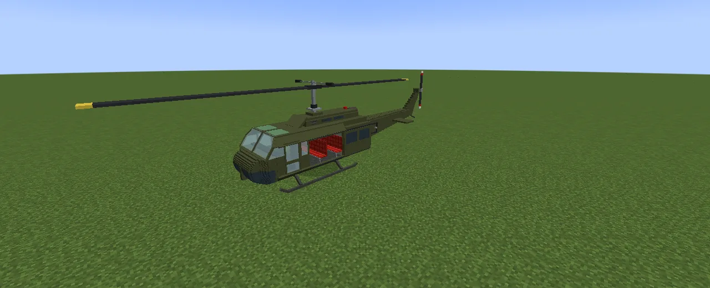
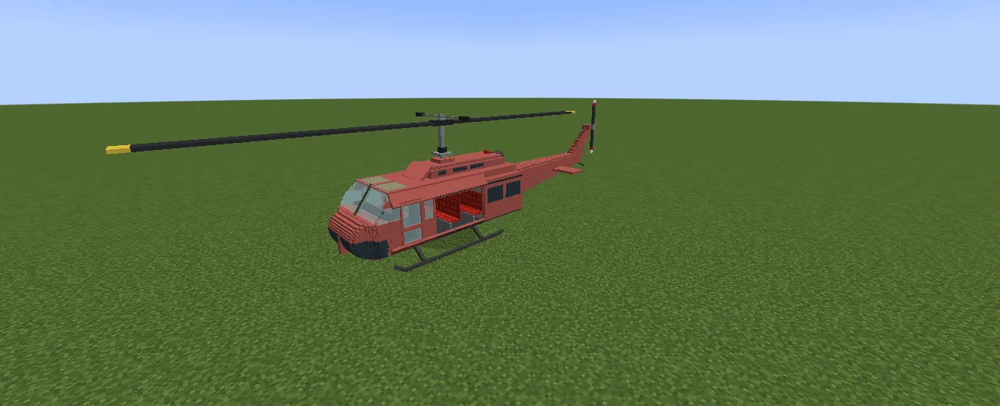
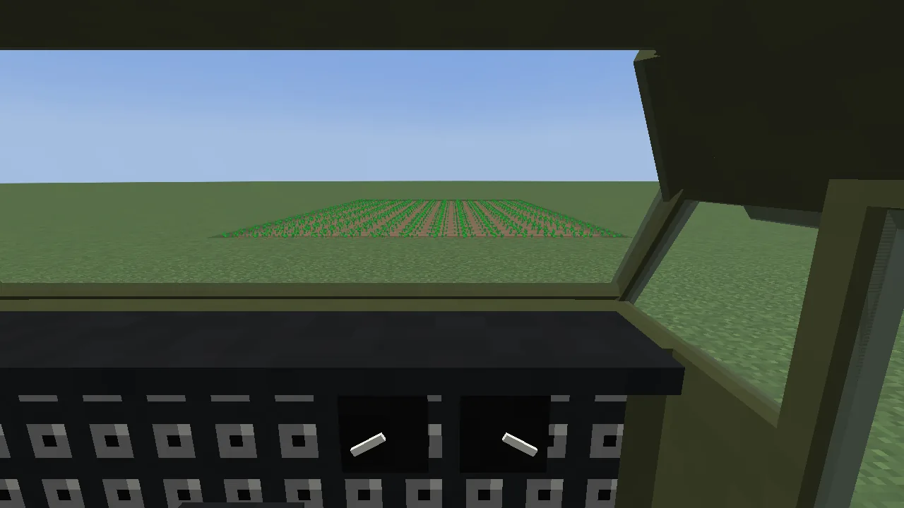
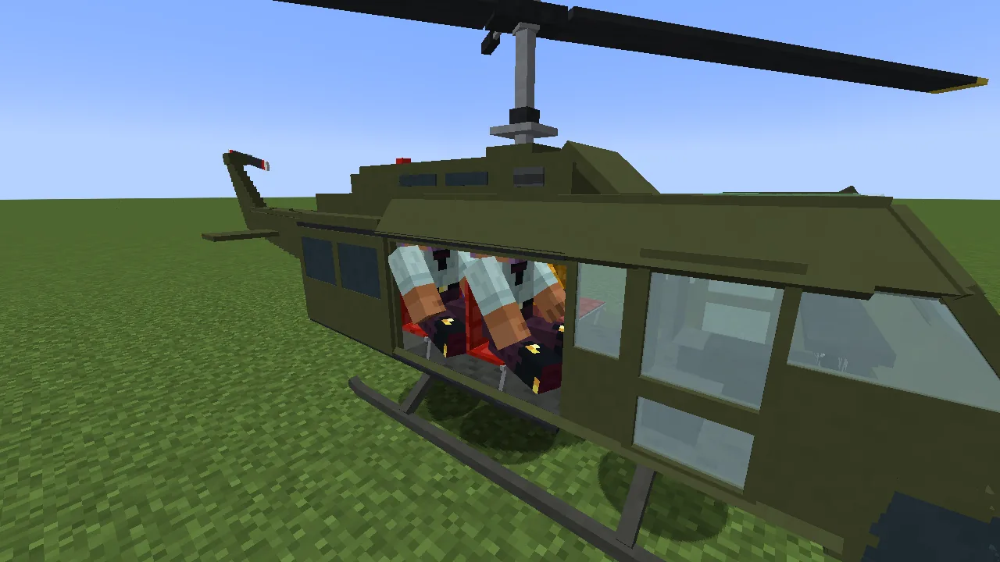
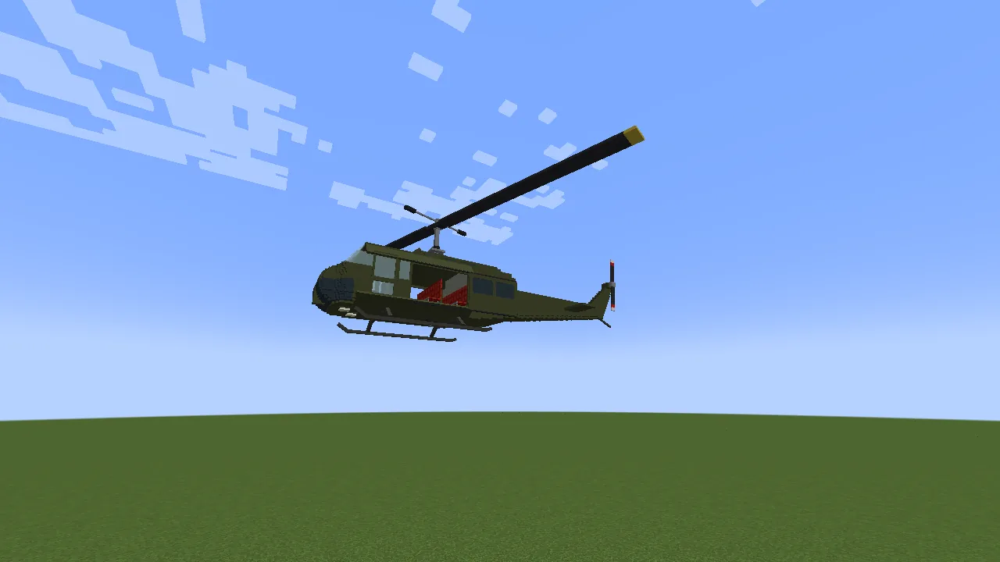
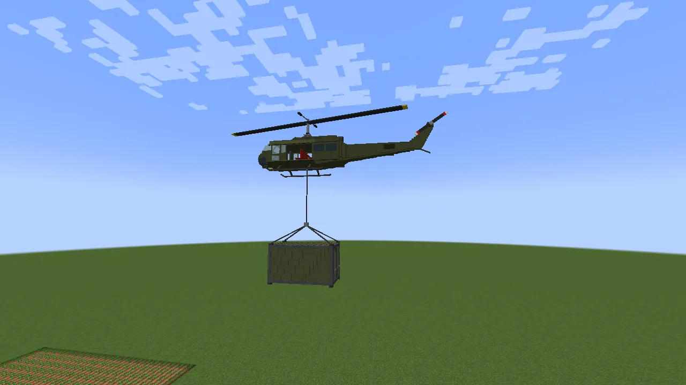
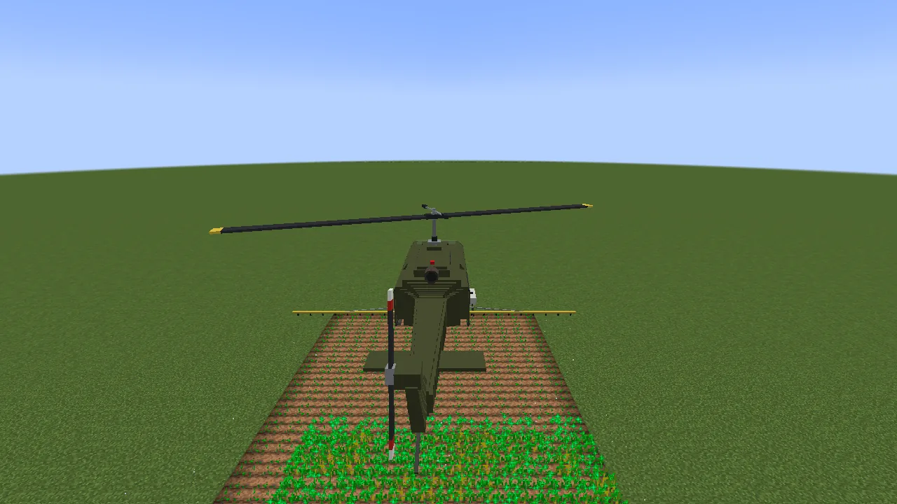

The **Huey** is a life-size Bell UH-1H helicopter, one block to a metre: twelve and a half blocks
long, with a rotor nearly fifteen across. A pilot and a copilot sit up front and six more ride on
red troop seats in the open cabin, with the cargo doors slid back so everyone can see out. It
lands on skids, carries the [Sling Container](/wiki/rotorcraft) on the hook under its belly, and
takes the crop sprayer for bone-mealing whole fields from the air. Flying works the same in every
[Rotorcraft](/wiki/rotorcraft) helicopter, so read that page too. Keys, fuel, paint and repairs are
[Vanilla Wheels](/wiki/vanilla-wheels)'s.

## Getting one

1. **The chassis:** three glass panes over six steel blocks:

   | | | |
   |---|---|---|
   | glass pane | glass pane | glass pane |
   | steel block | steel block | steel block |
   | steel block | steel block | steel block |

2. **Build it** on a **Mechanic Lift** with the chassis and an **engine**. It needs no wheels (it
   stands on skids). It comes out olive drab; put a dye in the lift and press **Paint** to colour
   it.

## Flying it

Get in and you're the pilot (the right-hand seat). The rotor takes about **three seconds** to spin
up before it will lift.

| Key | What it does |
|---|---|
| **W / S** | fly forward / back |
| **A / D** | turn |
| **Space** | climb |
| **Left Shift** | descend (it slows down by itself near the ground, so holding it all the way down always lands softly) |
| **R** | get out (only within three blocks of the ground) |
| **G** | hook or let go a load |
| **V** | crop sprayer on / off |
| **H** | lights |

Let go of everything and it hovers in place. **Nobody aboard is ever hurt by flying**, but flying
into things damages the helicopter: repair it like any vehicle, with **steel ingots**. If it runs
out of fuel in the air it glides down gently on its spinning rotor.

## Carrying the Sling Container

Load the container on the ground (animals in through its doors, things in its two chests), hover
over it until the hook is just above its ring, and press **G**. Climb and it lifts off on its rope.
Hold **Shift** to set it down softly, then press **G** again to let go.

## The crop sprayer

Right-click the Huey with a **crop sprayer** to fit it, then right-click with **bone meal** (or bone
blocks) to fill its tank. Fly low over your crops (within twelve blocks) and press **V**: it uses one
bone meal per crop it reaches, along an eleven-block-wide strip.

## Numbers

Top speed 1.4 blocks a tick (about 100 km/h); climbs 0.4 and descends 0.5 a tick; 36 000 ticks of
fuel (half an hour of flying).
